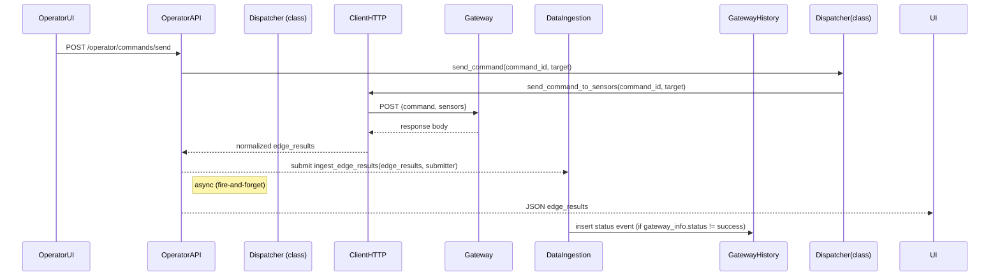

# Data flow for operator_api to client_http

This document describes the command dispatch path and data structures between the Operator API and the HTTP client module.

## Flow (high level)
1. The UI sends POST /operator/commands/send with a JSON body.
2. operator_api.send() parses command_id, issued_by, and target.
3. CommandDispatcher routes the command to _send_command_to_sensors (cmd_01).
4. client_http.send_command_to_sensors fans out requests to gateways in parallel.
5. client_http._normalize_result converts each gateway response to a normalized structure.
6. operator_api returns the normalized results as JSON.
7. operator_api submits ingest_edge_results asynchronously with submitter=issued_by.



## Operator API input
POST /operator/commands/send

```json
{
  "command_id": "cmd_01",
  "issued_by": "operator_01",
  "target": {
    "gateway_01": ["t1", "aq1"],
    "gateway_02": []
  }
}
```

Notes:
- target is a dict mapping gateway_id to a list of field device IDs.
- An empty list means "all field devices" for that gateway.

## Client HTTP outgoing payload to gateway
POST {gateway_base_url}{cfg.COMMAND_ENDPOINT}

```json
{
  "command": "cmd_01",
  "sensors": ["t1", "aq1"]
}
```

Notes:
- The payload key is sensors for backward compatibility; it represents a list of field device IDs.

## Gateway response (raw body)
client_http supports two shapes and normalizes both:

A) list of items with record:
```json
[
  {
    "time_stamp": "2026-05-22T12:00:00Z",
    "record": {
      "id": "84F3EB12A0BC-t1",
      "type": "sensor",
      "status": "OK",
      "severity": "info",
      "value": 24.8,
      "message": "Temperature acquired",
      "timestamp": "2026-02-16T15:40:12Z"
    }
  }
]
```

B) dict with records list:
```json
{
  "time_stamp": "2026-05-22T12:00:00Z",
  "records": [
    {
      "id": "84F3EB12A0BC-aq1",
      "type": "sensor",
      "status": "OK",
      "severity": "info",
      "value": 10.2,
      "message": "Air quality acquired",
      "timestamp": "2026-02-16T15:40:12Z"
    }
  ]
}
```

## Normalized result per gateway (client_http)
Returned by client_http.send_command_to_sensors for each gateway_id.

```json
{
  "gateway_info": {
    "status": "success",
    "code": 200,
    "error": null,
    "req_timestamp": "2026-02-16T15:40:12Z"
  },
  "records": {
    "84F3EB12A0BC-t1": {
      "type": "sensor",
      "status": "OK",
      "severity": "info",
      "value": 24.8,
      "message": "Temperature acquired",
      "timestamp": "2026-02-16T15:40:12Z"
    }
  }
}
```

Error case (per gateway):
```json
{
  "gateway_info": {
    "status": "error",
    "code": 104,
    "error": "Connection refused",
    "req_timestamp": "2026-02-16T15:40:12Z"
  },
  "records": {}
}
```

## Operator API output (current)
operator_api returns a dict of gateway_id to normalized result.

```json
{
  "gateway_01": {
    "gateway_info": { "status": "success", "code": 200, "error": null, "req_timestamp": "..." },
    "records": {
      "84F3EB12A0BC-t1": { "type": "sensor", "status": "OK", "severity": "info", "value": 24.8, "message": "...", "timestamp": "..." }
    }
  },
  "gateway_02": {
    "gateway_info": { "status": "error", "code": 104, "error": "...", "req_timestamp": "..." },
    "records": {}
  }
}
```

Validation error response (if Pydantic check fails):
```json
{
  "status": "error",
  "message": "Pydantic validation error: ..."
}
```

## Async ingestion and gateway history
operator_api schedules ingestion in the background and does not wait for DB writes.
ingest_edge_results validates edge_results and creates a gateway status event when a gateway
response is not successful.

Gateway history mapping (current):
- status: "active" when gateway_info.status == "success", otherwise "inactive"
- source: "operator" when submitter is provided, otherwise "telemetry"
- operator_id: optional in schema (not populated in the current helper)

Gateway history record example:
```json
{
  "record_type": "gateway_status_event",
  "device_id": "gateway_01",
  "timestamp": "2026-05-25T12:00:00Z",
  "data": {
    "status": "inactive",
    "source": "operator",
    "operator_id": null
  }
}
```

## Pydantic schema reference (operator_api)
This is the shape expected by the validation step:

```text
GatewayInfo:
  status: "success" | "error"
  code: int
  error: str | null
  req_timestamp: str

FieldDeviceResult:
  type: str
  status: str
  severity: str
  value: float | null
  message: str
  timestamp: str

DeviceResult:
  gateway_info: GatewayInfo
  records: dict[str, FieldDeviceResult]

EdgeResults:
  edge: dict[str, DeviceResult]
```
