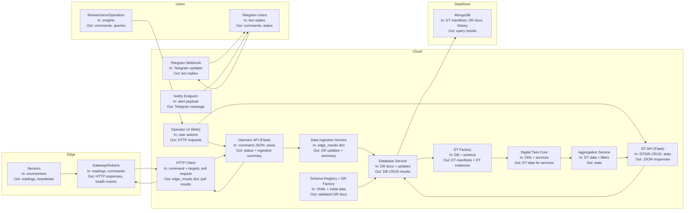

# Architecture Scheme (Nodes + I/O)

This document captures the current high-level data flow and the input/output of each node in the system.

## Mermaid Flowchart



## ASCII Overview

```
[Environment]
    |
    v
[Sensors]
 In: environment
 Out: readings, heartbeats
    |
    v
[Gateway/Arduino]
 In: readings, commands
 Out: HTTP responses, health events
    |
    v
[HTTP Client]
 In: command + targets, poll request
 Out: edge_results dict, poll results
    |
    v
[Operator API]
 In: command JSON, views
 Out: status + ingestion summary
    |
    v
[Data Ingestion]
 In: edge_results dict
 Out: DR updates + summary
    |
    v
[Database Service]
 In: DR docs + updates
 Out: DB CRUD results
    |
    v
[MongoDB]
 In: DT manifests, DR docs, history
 Out: query results

[DT API] <-> [DT Factory] <-> [DT Core] <-> [Aggregation Service]
 In: DT/DR CRUD, stats     In: DRs + services  Out: stats
 Out: JSON responses

[Telegram Webhook] -> [Telegram Users]
 In: Telegram updates  Out: bot replies
[Notify Endpoint] -> [Telegram Users]
 In: alert payload     Out: Telegram message
```

## Node I/O Catalog

| Node | Inputs | Outputs |
| --- | --- | --- |
| Sensors | Environment | Readings, heartbeats |
| Gateway/Arduino | Sensor readings, HTTP commands | HTTP responses, health events |
| Operator UI (Web) | User actions | HTTP requests to Operator API and DT API |
| Operator API (Flask) | Command JSON, view requests | Status JSON, ingestion summary, device results |
| HTTP Client | Command + targets, poll request | edge_results dict, poll results |
| Data Ingestion Service | edge_results dict, DB service | Updated sensor and gateway DRs, ingestion summary |
| Schema Registry + DR Factory | YAML templates, initial data | Validated DR documents |
| Database Service | DR docs + updates | MongoDB CRUD results |
| MongoDB | DT manifests, DR docs, history events | Query results |
| DT Factory | DB service + schema registry | DT manifests, DT instances |
| Digital Twin Core | DRs, services | DT data for services |
| Aggregation Service | DT data, filters | Stats (count, mean, min, max, stddev) |
| DT API (Flask) | DT/DR CRUD, stats requests | JSON responses |
| Telegram Webhook | Telegram updates | Bot replies |
| Notify Endpoint | Alert payload | Telegram message |
| Telegram Users | Commands, status | Bot replies, notifications |
