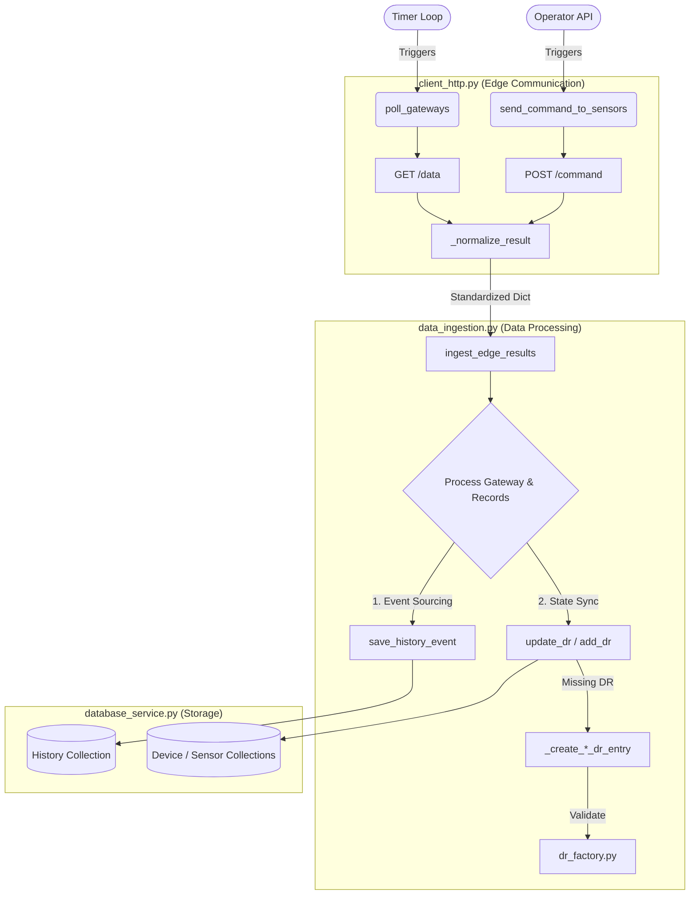

# Data Flow Architecture: Polling & Command Ingestion

This document details the complete end-to-end information flow for the two primary operations in the Cloud Platform: **Polling Gateways (Telemetry)** and **Sending Commands (Control)**. 

Both operations rely on edge gateway communication, but they conceptually merge into a single unified data ingestion pipeline to update the **Digital Replicas (DR)** and the **History Collection**.

---

## 1. High-Level Flow Diagram



---

## 2. Phase 1: Edge Communication & Convergence (`client_http.py`)

The workflow begins in the HTTP Client module, which handles parallel HTTP requests to the edge gateways.

### Flow A: Passive Polling
- **Function:** `poll_gateways()`
- **Trigger:** A background loop (e.g., `while True` timer).
- **Action:** Uses a `ThreadPoolExecutor` to execute `_poll_gateway()` for all configured `EDGE_DEVICES`. It sends a standard `GET /data` request.
- **Goal:** Periodically harvest all accumulated telemetry data from the gateways.

### Flow B: Active Commands
- **Function:** `send_command_to_sensors(command, target)`
- **Trigger:** An explicit action from an operator (`operator_api.py`) or a rule engine.
- **Action:** Uses a `ThreadPoolExecutor` to execute `_send_http_command()` to specific gateways. It sends a `POST /command` request with a JSON payload.
- **Goal:** Actively force edge devices to perform an action and immediately return the result.

### The Convergence Point: `_normalize_result()`
Regardless of whether the data was passively polled or actively requested, the raw HTTP response is passed to `_normalize_result()`. This function acts as an adapter, transforming varying edge schemas into one **Unified Data Dictionary**.

**The Unified Dictionary Structure:**
```json
{
    "gateway_alpha": {
        "gateway_info": {
            "status": "success",
            "code": 200,
            "error": null,
            "req_timestamp": "2026-06-04T10:00:00Z"
        },
        "records": {
            "84F3EB12A0BC-t1": {
                "type": "sensor",
                "status": "OK",
                "value": 24.8,
                "timestamp": "2026-06-04T09:59:58Z"
            }
        }
    }
}
```

---

## 3. Phase 2: Data Ingestion (`data_ingestion.py`)

The unified dictionary is passed directly into `ingest_edge_results(db_service, results, ...)`. This module is completely agnostic to *how* the data was collected. It iterates through the dictionary and performs two distinct operations for both the Gateways and the individual Sensors/Actuators.

### Operation 1: Event Sourcing (History)
Every incoming payload represents an event in time. The system records an immutable log of what happened.
1. **Gateways:** Calls `_create_gateway_record()` to generate a `gateway_status_event` tracking gateway health and HTTP codes.
2. **Devices:** Calls `_create_sensor_record()` (or actuator equivalent) to generate a `sensor_reading_event` containing the raw sensor values.
3. **Storage:** These events are passed to `db_service.save_history_event()`.

### Operation 2: State Synchronization (Digital Replicas)
The Digital Replicas must reflect the *latest known state* of the edge devices.
1. **Lookup:** The system calls `_find_dr(db_service, device_id)` to see if the gateway or sensor already exists in the database.
2. **If DR Exists (Update):**
   - Extracts the latest `value` and `timestamp`.
   - Calls `db_service.update_dr()` to perform a partial update (`$set`) on the DR's `data` section and bump the `metadata.last_update` timestamp.
3. **If DR is Missing (Auto-Creation):**
   - Calls `_create_gateway_dr_entry()` or `_create_sensor_dr_entry()`.
   - These functions build the initial `profile` (inferring types, generating names) and pass it to `DRFactory`.
   - The `DRFactory` validates the data against the YAML templates (`gateway.yaml`, `sensor.yaml`), applies defaults, and returns a sanitized dictionary.
   - Finally, `db_service.add_dr()` is called to insert the brand new DR into MongoDB.

---

## 4. Phase 3: Persistence (`database_service.py`)

The Database Service abstracts MongoDB and utilizes the `SchemaRegistry` to route data.

- **`save_history_event(history_event)`**: Inserts the immutable log entry into the history collection defined by `sensor_history.yaml`.
- **`add_dr(dr_entry)`**: Uses `schema_registry.get_collection_name(dr_type)` to determine the correct MongoDB collection (e.g., `device_collection`). The driver automatically generates the primary `_id` upon `insert_one`.
- **`update_dr(dr_type, dr_id, update_data)`**: Executes a lightweight `updateOne` operation targeting the specific `_id`, applying the nested `$set` payload, and refreshing the metadata timestamps.

> [!TIP]
> **Why this architecture is powerful:**
> Because both telemetry polling and active commands funnel into the exact same normalization logic, any new features, machine-learning models, or databases added to `data_ingestion.py` will automatically benefit both data collection methods without duplicating code.
